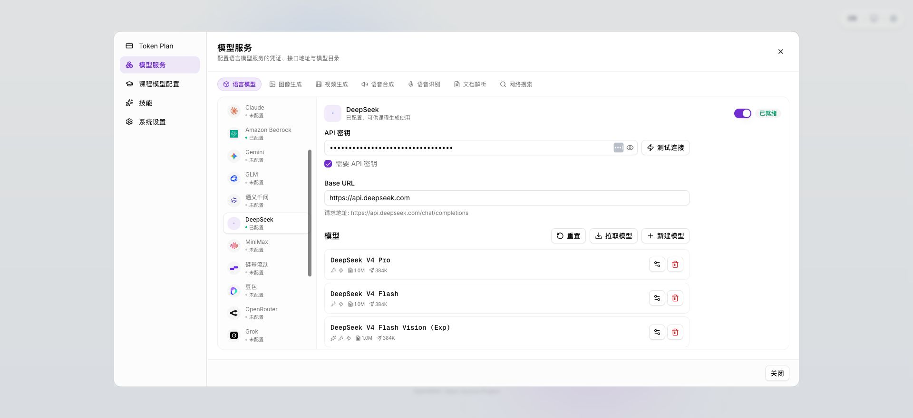
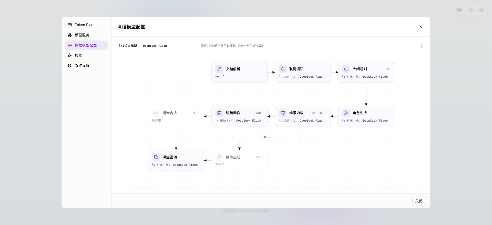

# OpenMAIC 入门使用教程：配置 DeepSeek 生成课程并导出 PPTX

> 本教程根据部署在 `http://47.238.125.229:3000/` 的 OpenMAIC 页面整理，使用 Chrome 操作。
>
> 本教程只覆盖两件事：
>
> 1. 配置 DeepSeek 语言模型并将它设为课程生成模型；
> 2. 生成课程后导出 PPTX。
>
> 图像生成、视频生成、语音合成、语音识别、文档解析、联网调研等功能暂不配置。

## 1. 准备信息

| 配置项 | 值 |
| --- | --- |
| OpenMAIC 地址 | `http://47.238.125.229:3000/` |
| DeepSeek Base URL | `https://api.deepseek.com` |
| DeepSeek 模型 ID | `deepseek-flash` |
| 模型显示名称 | `DeepSeek Flash` |
| API Key | 使用管理员提供的 DeepSeek Key；不要把完整 Key 写入文档、截图或 Git 仓库 |

> **安全提示**：API Key 属于敏感凭证。输入时直接粘贴到配置页面即可；截图中应保持掩码状态，也不要将完整 Key 发到群聊或提交到代码仓库。

## 2. 打开系统并通过访问码

1. 使用 Chrome 打开：`http://47.238.125.229:3000/`。
2. 如果页面弹出“请输入访问码”，输入部署管理员提供的站点访问码。
3. 进入首页后，看到“输入你想学的任何内容……”输入框，即表示已经进入课程创建页面。

## 3. 配置 DeepSeek 提供方

### 3.1 打开模型配置

首次进入时，点击首页的 **配置模型**。如果已经配置过模型，则点击首页模型选择器旁边的设置按钮，再进入 **模型服务**。

在设置窗口中：

1. 进入 **模型服务**；
2. 左侧选择 **语言模型**；
3. 选择 **DeepSeek**。

### 3.2 填写 DeepSeek 连接信息

在 DeepSeek 配置面板中填写：

- **API 密钥**：粘贴 DeepSeek API Key；
- **Base URL**：填写 `https://api.deepseek.com`，不要额外添加 `/v1`；
- **需要 API 密钥**：保持勾选；
- **启用此提供方**：填写 Key 后保持开启。

填写完成后，页面应显示“已配置，可供课程生成使用”。



### 3.3 新建 `deepseek-flash` 模型

在 DeepSeek 配置面板的“模型”区域：

1. 点击 **新建模型**；
2. **模型 ID** 填写 `deepseek-flash`；
3. **显示名称**填写 `DeepSeek Flash`；
4. **工具**、**流式**保持默认开启；
5. 不需要勾选“视觉”；
6. 点击 **保存**。

保存后，模型列表中应出现“DeepSeek Flash”。

## 4. 将 DeepSeek Flash 设为课程生成模型

1. 在设置窗口中进入 **课程模型配置**。
2. 点击顶部的 **主线语言模型**卡片（默认可能是其他模型）。
3. 在模型列表中选择：
   - 显示名称：`DeepSeek Flash`
   - 模型 ID：`deepseek-flash`
4. 选择完成后，联网调研、大纲规划、角色生成、场景内容、讲稿动作、课堂互动等跟随主线的环节会显示“跟随主线：DeepSeek Flash”。
5. 点击 **关闭**返回首页。



> 这里配置的是“课程生成链路”的主线语言模型，不需要再分别配置其他模型。

## 5. 生成测试课程

回到首页，在输入框中输入以下课程名称：

```text
如何有效提升中文水平
```

然后点击 **进入课堂**。


系统通常会先进入“生成课程大纲”页面，随后生成课程内容。等待生成完成后进入课堂播放页。

### 可选：让课程更具体

如果只输入课程名称不够具体，也可以输入一段简短要求，例如：

```text
如何有效提升中文水平。面向中文学习者，包含词汇、语法、阅读、写作和口语练习，给出可执行的学习计划和练习示例。
```

## 6. 下载 PPTX 课程

进入课程播放页并等待课程内容加载完成后：

1. 在页面顶部右侧找到 **下载**图标（向下箭头）；
2. 点击下载图标打开导出菜单；
3. 选择 **导出 PPTX**；
4. 等待导出完成，Chrome 会下载一个 `.pptx` 文件；
5. 在 Chrome 的下载列表或默认下载目录中打开该文件。

导出菜单还可能提供“导出教学资源包”等选项；本教程只需要选择 **导出 PPTX**。

> 如果“导出 PPTX”按钮不可用，先确认课程已经完成生成，并且页面上的媒体生成任务已经结束或失败处理完成。

## 7. 本次实际验证结果

本次在 Chrome 中完成并确认了：

- DeepSeek 提供方配置已保存；
- Base URL 使用 `https://api.deepseek.com`；
- 已新增 `deepseek-flash` / `DeepSeek Flash`；
- 课程模型配置的主线语言模型已切换为 `DeepSeek Flash`；
- 测试课程名称已使用“如何有效提升中文水平”。

需要特别说明：这不是访问码填写错误。访问码验证接口本身返回成功，但当前部署通过 HTTP IP 地址访问时，生产环境返回的 `openmaic_access` Cookie 带有 `Secure` 属性，Chrome 不会在 HTTP 请求中回传该 Cookie，后续 API 请求因此仍返回未授权。点击“进入课堂”后服务端表现为：

```text
Access code required
```

因此本次未能进入课程播放页，也无法继续实际下载 PPTX。对应页面截图如下：


### 处理建议

当前访问地址是 HTTP IP 地址，而部署启用了 `ACCESS_CODE` 站点访问码。建议部署管理员优先选择以下方案之一：

1. 为服务器配置 HTTPS，然后继续使用 `ACCESS_CODE`；或
2. 在可信内网环境中暂时关闭 `ACCESS_CODE`，重新部署后再测试生成与 PPTX 导出；或
3. 修正部署中的访问码 Cookie 配置，使 HTTP/HTTPS 的实际访问方式与 Cookie 的 `Secure` 属性匹配。

修复访问码问题后，按第 5、6 节重新操作即可完成课程生成和 PPTX 下载。

## 8. 最小配置清单

完成最小可用配置时，只需要确认以下项目：

- [ ] DeepSeek 已启用；
- [ ] API Key 已填写；
- [ ] Base URL 为 `https://api.deepseek.com`；
- [ ] 模型 ID 为 `deepseek-flash`；
- [ ] 课程模型配置 → 主线语言模型 → `DeepSeek Flash`；
- [ ] 首页输入课程名称；
- [ ] 课程完成后点击下载 → **导出 PPTX**。
